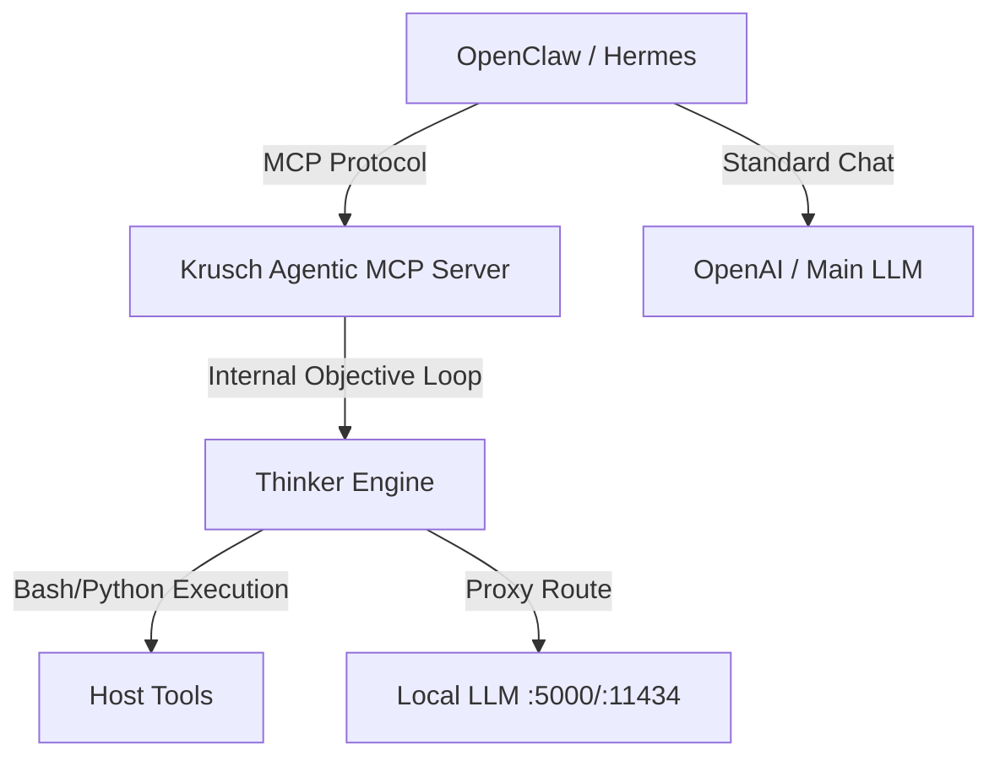

# OpenClaw & Hermes Integration Guide

Krusch Agentic Proxy is fundamentally designed to give conversational agents an "Autonomous Coding Cortex". 
Instead of forcing OpenClaw to format JSON itself, OpenClaw delegates tasks via the Model Context Protocol (MCP).

## The Paradigm


## Setup for OpenClaw / Cursor / Claude Desktop
Add the following to your MCP configuration JSON:
```json
{
  "mcpServers": {
    "krusch-agentic-execution": {
      "command": "uv",
      "args": [
        "--directory",
        "/home/kruschdev/homelab/projects/krusch-agentic-mcp",
        "run",
        "krusch-agentic-mcp"
      ]
    }
  }
}
```

When connected, OpenClaw will automatically gain access to the `krusch_execute_task(objective: str)` tool. When you ask OpenClaw to perform a complex multi-step coding task, it will hand the objective off to Krusch, wait for the background execution loop to finish, and present you with the final result!
